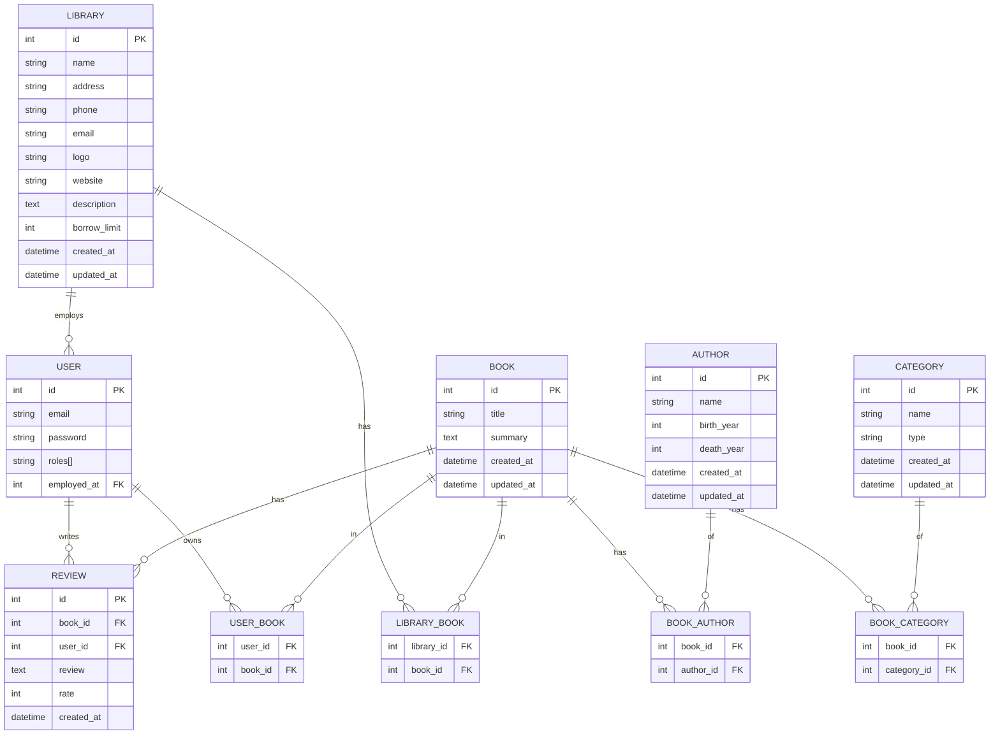

# Cahier des Charges `ZeLibrary`
---
## 1. Description

### 1.1 Concept de base
`ZeLibrary` est une application de gestion de bibliothèque. Cette application permet aux utilisateurs de gérer leurs livres, faire des reviews et des notes sur les livres.

### 1.2 Idées d'évolution
On pourrait imaginer que les bibliothèques utilisent cette application pour gérer leurs livres, proposer des reservations de livres, etc.

### 1.3 Idées d'évolution (Hors scope)
Si on pousse un peu plus loin l'idée, les utilisateurs pourraient vendre/troquer leurs livres avec d'autres utilisateurs.

---
## 2. Différents types d'utilisateurs

### 2.1 Utilisateurs
- Utilisateur lambda (un lecteur) : `User`
- Utilisateur bibliothécaire (un employé d'une bibliothèque) : `LibraryEmployee`
- Utilisateur administrateur (un administrateur de la plateforme) : `Admin`

### 2.2 User Stories
#### 2.2.1 Utilisateur lambda
Un utilisateur lambda peut :
- Se connecter
- Se déconnecter
- Ajouter un livre à sa bibliothèque
- Supprimer un livre de sa bibliothèque
- Rechercher un livre
- Afficher la liste des livres
- Afficher un livre
- Afficher la liste des utilisateurs
- Afficher un utilisateur
- Trouver un livre disponible à l'emprunt dans une bibliothèque
- Demander à réserver un livre

#### 2.2.2 Utilisateur bibliothécaire
Un utilisateur bibliothécaire peut :
- Gérer les utilisateurs
- Gérer les livres
- Gérer les bibliothèques
- Gérer les emprunts
- Gérer les réservations
- Gérer les reviews
- Gérer les notes

#### 2.2.3 Utilisateur administrateur
Un utilisateur administrateur peut :
- Gérer les utilisateurs
- Gérer les livres
- Gérer les bibliothèques
- Gérer les emprunts
- Gérer les réservations
- Gérer les reviews
- Gérer les notes


### 2.3 Entities
#### 2.3.1 Entity User
##### Détail de l'entité
```
Nom de l'entité : User
- id : int
- email : string
- password : string
- roles : array
- collection : relation avec Collection
```
##### Stories
- Un utilisateur peut avoir plusieurs rôles
- Un utilisateur peut avoir une bibliothèque personnel (Collection)

#### 2.3.2 Entity Book
##### Détail de l'entité
```
Construit sur la base du modèle de Gutendex
Nom de l'entité : Book
- id : int
- title : string
- summary : text
- languages : array
- copyright : boolean
- mediaType : string
- formats : array
- downloadCount : int
- gutendexId : int
- createdAt : datetime
- updatedAt : datetime
```
##### Stories 
- Un livre peut appartenir à quelqu'un (dans une bibliothèque personnel)
- Un livre peut appartenir à une bibliothèque (dans une bibliothèque officielle)
- Un livre peut être emprunté par quelqu'un (uniquement dans une bibliothèque officielle)
- Un livre peut être réservé par quelqu'un (uniquement dans une bibliothèque officielle)
- Un livre peut être retourné par quelqu'un (uniquement dans une bibliothèque officielle)


#### 2.3.3 Entity Library
Library représente une bibliothèque officielle. 
##### Détail de l'entité
```
Nom de l'entité : Library
- id : int
- name : string
- address : string
- phone : string
- email : string
- logo : string
- website : string
- description : text
- borrowLimit : int
- booksCollection : relation avec Book (Many to Many)
- employees : relation avec User (One to Many)
- createdAt : datetime
- updatedAt : datetime
```
##### Stories 
- Une bibliothèque peut avoir plusieurs livres (dans une collection)
- Une bibliothèque peut avoir plusieurs emprunteurs
- Une bibliothèque peut avoir plusieurs emprunts


#### 2.3.5 Entity Borrow
Borrow représente un emprunt d'un livre par un utilisateur.
##### Détail de l'entité
```
Nom de l'entité : Borrow
- id : int
- book : relation avec Book
- user : relation avec User
- library : relation with Library
- status : string
- createdAt : datetime
- updatedAt : datetime
```

##### Stories
- Un emprunt peut avoir un statut :
    - Reservation en attente de validation,
    - Reservé,
    - En cours,
    - terminé,
    - en retard,
    - perdu,
    - volé,
    - restitué
- Un emprunt peut avoir une date d'emprunt
- Un emprunt peut avoir une date de retour


#### 2.3.6 Entity Review
Review représente une review d'un livre par un utilisateur.
##### Détail de l'entité
```
Nom de l'entité : Review
- id : int
- book : relation avec Book
- user : relation avec User
- review : text
- rate : int
- createdAt : datetime
- updatedAt : datetime
```
##### Stories
- Une review peut avoir un commentaire
- Une review peut avoir une note


## 3. Fonctionnalités
### 3.1 Fonctionnalités communes
- Gestion des utilisateurs
- Gestion des livres
- Gestion des bibliothèques
- Gestion des emprunts
- Gestion des réservations
- Gestion des reviews
- Gestion des notes

### 3.2 Fonctionnalités spécifiques

### 3.3 Boite à idées
- Utiliser une API de livres pour récupérer les informations des livres
- Utiliser l'API OpenAI pour analyser la demande d'un utilisateur qui cherche un livre selon sa demande, puis retourner une liste de livres possibles, checker si on a le livre dans la base de donnée, autrement, utiliser l'API de livres.

---


## 4. État actuel du projet (backend + frontend) Le 30/09/2025 à 19:09

### 4.1 Backend (Symfony 7 + API Platform)
- Authentification via JWT (LexikJWT) avec cookies HTTP-only; le frontend appelle l’API avec `credentials: include`.
- Sérialisation/normalisation par groupes (`book:read`, `books:read`, `review:read`, `book-collection:read`, etc.).
- Entités persistées: `User`, `Book`, `Author`, `Category`, `Library`, `Review`.
- Relations:
  - `User` 1—n `Review`
  - `Book` 1—n `Review`
  - `User` n—n `Book` (collection personnelle via table de jointure)
  - `Book` n—n `Author`
  - `Book` n—n `Category`
  - `Library` 1—n `User` (employés)
  - `Library` n—n `Book`

#### Endpoints exposés (principaux)
- Livres
  - GET `/books` (liste)
  - GET `/books/{id}` (détail)
  - GET `/me/books-collection` (liste des livres de l’utilisateur courant) [auth]
  - POST `/me/add-book-to-my-collection/{book}` [auth]
  - DELETE `/me/delete-book-from-my-collection/{book}` [auth]
  - GET `/me/is-book-in-my-collection/{book}` [auth]
- Auteurs
  - GET `/authors`, GET `/authors/{id}`
- Catégories
  - GET `/categories`, GET `/categories/{id}`
- Bibliothèques
  - GET `/libraries`, GET `/libraries/{id}`
- Reviews
  - GET `/reviews`
  - POST `/reviews/books/{id}` (création d’un avis pour un livre) [auth]
  - DELETE `/reviews/{review}` [auth]
- Utilisateur
  - GET `/users/{id}` [auth]

### 4.2 Frontend (Nuxt 4.1 + TypeScript + Tailwind)
- Pages principales:
  - `pages/books/index.vue`: liste des livres (recherche et pagination via `ResourceCollection`).
  - `pages/books/[id]/index.vue` + `components/BookPage.vue`: détail d’un livre, reviews, bouton “Ajouter à ma collection” (masqué si déjà présent), lien “Ajouter un avis” pour les utilisateurs connectés.
  - `pages/collection.vue`: liste de la collection personnelle; suppression avec modal de confirmation et rafraîchissement sans rechargement.
  - `pages/login.vue`: authentification.
- Composants et composables clés:
  - `components/ResourceCollection.vue`: composant générique de liste avec recherche, pagination, gestion du chargement/erreur.
  - `composable/useApi.ts`: wrapper `$fetch` avec baseURL et `withCredentials` configurable.
  - `composable/useAuth.ts`: état d’auth (ex. `isAuth`).

---

## 5. Entités (modèle actuel)

### 5.1 User
- `id: int`
- `email: string`
- `password: string`
- `roles: string[]`
- `employedAt: ?Library` (ManyToOne)
- `booksCollection: Book[]` (ManyToMany)
- `reviews: Review[]` (OneToMany)

### 5.2 Book
- `id: int`
- `title: string`
- `summary?: text`
- `createdAt: datetime`
- `updatedAt: datetime`
- `authors: Author[]` (ManyToMany)
- `categories: Category[]` (ManyToMany)
- `libraries: Library[]` (ManyToMany)
- `reviews: Review[]` (OneToMany)
- Calculé: `averageRate: float`

### 5.3 Author
- `id: int`
- `name: string`
- `birthYear?: int`
- `deathYear?: int`
- `createdAt: datetime`
- `updatedAt: datetime`
- `books: Book[]` (ManyToMany)

### 5.4 Category
- `id: int`
- `name: string`
- `type?: string` (ex. `subject`, `bookshelf`)
- `createdAt: datetime`
- `updatedAt: datetime`
- `books: Book[]` (ManyToMany)

### 5.5 Library
- `id: int`
- `name: string`
- `address: string`
- `phone?: string`
- `email?: string`
- `logo?: string`
- `website?: string`
- `description?: text`
- `borrowLimit?: int`
- `createdAt: datetime`
- `updatedAt: datetime`
- `employees: User[]` (OneToMany)
- `booksCollection: Book[]` (ManyToMany)

### 5.6 Review
- `id: int`
- `book: Book` (ManyToOne)
- `user: User` (ManyToOne)
- `review: text`
- `rate: int` (1..5)
- `createdAt: datetime`

---

## 6. Schéma ER (Mermaid) — entités et tables de jointure

